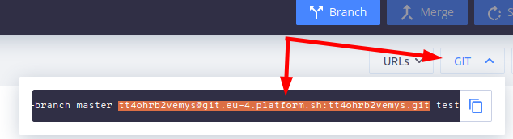

# Deploy on platform.sh

## Deploy with one click

<p align="center">
<a href="https://console.platform.sh/projects/create-project?template=https://raw.githubusercontent.com/droptica/droopler_project/dev/platformsh/platform.template.yaml">
    
</a>
</p>

## Other methods
### Preparation:
- add your SSH Key under https://accounts.platform.sh/user/ -> **Account Settings** -> **SSH keys**
- find GIT remote URL in git clone command for your environment, ex.

- deploy using one of methods below.

### Deploy from droopler-project platformsh branch
#### using GIT
```
git clone https://github.com/droptica/droopler_project.git -b dev/platformsh
git remote remove origin
git remote add platform GIT_REMOTE_URL
git push -u platform dev/platformsh:master
```
#### using composer
```
composer create-project droptica/droopler-project:dev-dev/platformsh droopler
cd droopler
git init
git add .
git commit -m 'init commit'
git remote add platform GIT_REMOTE_URL
git push -u platform master
```

### Deploy from scratch using droopler-project master
Download platformsh integration folders and file from
https://github.com/droptica/droopler_project/tree/dev/platformsh
```
.platform/
platform-integrations/
.platform.app.yaml
```
Deploy using composer.
```
composer create-project droptica/droopler-project droopler "^8.2.0"
cd droopler
composer require platformsh/config-reader
# copy downloaded folders and file
git init
git add.
git commit -m 'init commit'
git remote add platform GIT_REMOTE_URL
git push -u platform master
```

# Usefull tool - `platform.sh cli`
Install https://docs.platform.sh/development/cli.html or download **phar** form: https://github.com/platformsh/platformsh-cli
Example usage (**phar** downloaded to project directory):

- command list
	```
	php platform.phar list
	```
- if we change php or redis version we need to clear build cache
	```
	php platform.phar project:clear-build-cache
	```
- redeploy
	```
	php platform.phar environment:redeploy
	```
